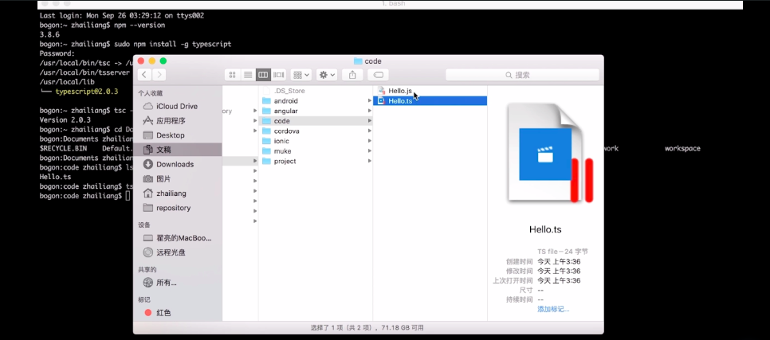
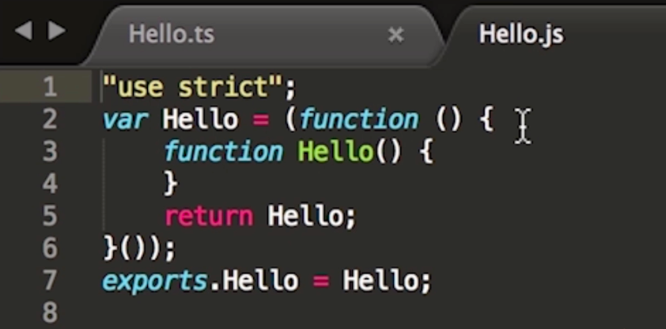

<h2>搭建typeScript</h2>
<h3>什么是compiler? 为什么需要compiler?</h3>
<p>所谓搭建TypeScript开发环境，就是安装TypeScript的compiler.</p>
<p>因为ES6规范是在2015年发布的，而目前所有的主流的浏览器并没有完全的支持ES6规范，所以用ES6语法写出来的程序，并不能直接放到浏览器里面去执行，所以需要一个compiler去把TypeScript代码转化成JavaScript代码，才能放到浏览器里面去跑。</p>
<h2>使用在线compiler开发</h2>
<p>使用在线compiler开发，这应该是TypeScript开发最方便的一种方式，因为根本没用所谓的安装过程，你只要安装一个浏览器就可以了，<a src="http://www.typescriptlang.org/play/index.html">访问在线compiler开发</a></p>
<p>我们可以看到左边是Typescript代码，右边是编译以后的Javascript代码，我们接下来将展示大部分的TypeScript的语法特性。</p>
<h2>使用本地compiler 开发</h2>
<p>刚才我们演示了线上的compiler，但是在实际项目中我们肯定不能用在线的compiler去开发，因为我们肯定会写很多的TypeScript文件，肯定是在我们本地的环境里面开发，下面我们就来演示如何搭建本地的开发环境。</p>
<h4> 第一步：安装Typescript的编译器</h4>
<p>所谓安装TypeScript的编译器就是安装TypeScript的过程,你需要先安装node.js，不知道先百度一下怎么装node.js</p>

``` js{0}
//安装TypeScript
sudo npm install -g typescript

//查看TypeScript cpmplier的版本号
tsc --version

//新建一个ts文件 Hello.ts
export class Hello{
 
}

//使用命令行进入刚才那个文件目录的位置
cd 那个ts文件的目录

//运行tsc命令
tsc Hello.ts

//我们去文件夹里面看一下，发现文件夹里面生成了一个Hello.js  
"use strict"
var Hello = (function () {
      function Hello() {
 
       }
       return Hello;
}());
exports,Hello = Hello;
```
<p>查看效果</p>


<p>查看TypeScript cpmplier的版本号</p>


<p>2、这里的 "完全" 是指本文会不断更新</p>
<p>3、这里的 "使用" 是指本文会展示很多 ES6 的使用场景</p>
<p>4、这里的 "手册" 是指你可以参照本文将项目更多的重构为 ES6 语法</p>

1 、let 和 const
---
<p>var 是传统的函数作用域。</p>
<p>let 是新的声明变量的方法，拥有块级作用域。这意味着在 for 循环中，if 语句内或者 plain 块中使用 let 声明的变量不会“逃出”所在的块，而 var变量则会被提升到函数定义。</p>
<p>const 和 like 相似，但是不可更改。</p>
<p>在我们开发的时候，可能应该默认使用 let 而不是 var，对于需要写保护的变量使用 const；展望 JavaScript 的发展，var 声明会逐渐消失，只剩下 let 和 const；更特别的是，由于不可变的特性，const 在今天已经出人意料的被广泛使用。</p>

<h5>1) 块级作用域 if</h5>

``` js{0}
/**
 * 变量 var
 */
function test(flag) {
    if (flag) {
        var a = 'js'
    } 
    // 这里也可以访问 a
}

/**
 * 变量 let
 */
 function test(flag) {
    if (flag) {
        let a = 'js'
    } 
    // 这里也访问不到 a
}

```
<h5>2) 块级作用域 for</h5>

``` js{0}
/**
 * 变量 var
 */
for(var i=0; i<2; i++){
    console.log('outer i: ' + i);
    for(var i=0; i<2; i++){
	console.log('inner i: '+i);
    }
}
//执行结果如下：
//outer i: 0
//test.html:12 inner i: 0
//test.html:12 inner i: 1

/**
 * 变量 let
 */
for(var i=0; i<2; i++){
    console.log('outer i: ' + i);
    for(let i=0; i<2; i++){
	console.log('inner i: '+i);
    }
}
// 执行结果如下：
// outer i: 0
// test.html:12 inner i: 0
// test.html:12 inner i: 1
// test.html:10 outer i: 1
// test.html:12 inner i: 0
// test.html:12 inner i: 1

```
<h5>3) 变量声明情况</h5>

``` js{0}
/**
 * 变量val先使用后声明，输出undefined，不报错。
 */
console.log(a) // undefined
var a;

/**
 * 把var换成let，就报错了
 */

console.log(a) // Uncaught ReferenceError: a is not defined
let a;

```
2、模板字符串
---
<p>需要拼接字符串的时候尽量改成使用模板字符串:</p>

``` js{0}

// bad
const string = 'this is a' + example;

// good 
const string = `this is a ${example}`;

//执行更复杂的表达式
const string1 = `something ${1 + 2 + 3}`
const string2 = `something ${foo() ? 'x' : 'y' }`

//字符串多行的
const string3 = `Hey
this
string
is awesome!`

//如果碰巧要在字符串中使用反撇号，可以使用反斜杠转义
let message = `Hello \` World`;
console.log(message);// Hello ` World

//打印的结果中第一行是一个换行，可以使用 trim 函数消除换行：
let message = `
	<ul>
		<li>1</li>
		<li>2</li>
	</ul>
`.trim();
console.log(message);
//输出如下
//<ul>
//		<li>1</li>
//		<li>2</li>
//	</ul>

//模板字符串支持嵌套
let arr = [{value: 1}, {value: 2}];
let message = `<ul>
		${arr.map((item) => {
			return `
				<li>${item.value}</li>
			`
		})}
	</ul>`;
console.log(message)

//输出如下：
//	<ul>
//		<li>1</li>
//    ,
//		<li>2</li>		
//	</ul>

//注意，在 li 标签中间多了一个逗号，这是因为当大括号中的值不是字符串时，会将其转为字符串，比如一个数组 //[1, 2, 3] 就会被转为 1,2,3，逗号就是这样产生的。
//如果要消除这个逗号，可以先 join 一下

let message = `
	<ul>
		${arr.map((item) => {
			return `
				<li>${item.value}</li>
			`
		}).join('')}
	</ul>
`;
//输出结果如下
//	<ul>
//		<li>1</li>
//		<li>2</li>		
//	</ul>

```
3、标签模板
---
<p>模板标签是一个非常重要的能力，模板字符串可以紧跟在一个函数名后面，该函数将被调用来处理这个模板字符串，举个例子：</p>

``` js{0}
let x = 'Hi', y = 'Kevin';
var res = message`${x}, I am ${y}`;
console.log(res);

/**
 * 自定义 message 函数来处理返回的字符串:
 * literals 文字
 * 注意在这个例子中 literals 的第一个元素和最后一个元素都是空字符串
 */
function message(literals, value1, value2) {
	console.log(literals); // [ "", ", I am ", "" ]
	console.log(value1); // Hi
	console.log(value2); // Kevin
}
```
<p>想看更多点这里：<a href="https://github.com/mqyqingfeng/Blog/issues/84">ES6 系列之模板字符串</a></p>

4、 箭头函数
---
<p>箭头函数改变了大多数 JavaScript 代码的书写习惯和工作方式。</p>

``` js{0}
//之前
const foo = function foo() {
  // ...
}

//变成
const foo = () => {
  // ...
}

//如果这个函数体只有一行，可以是这样：
const foo = () => doSomething()

//如果只有一个参数，可以是这样：
const foo = param => doSomething(param)

```
<h4>新的 this 作用域</h4>
<ul>
<li>箭头函数中的 this 从执行上下文继承。</li>
<li>在以前的常规函数中，this 通常指最近的函数。然而在箭头函数中这个问题没有了，你不再需要重写一遍 var that = this。</li>
</ul>

<p>优先使用箭头函数，不过以下几种情况避免使用：</p>
<h5>1. 使用箭头函数定义对象的方法</h5>

```js{0}
const calculator = {
    array: [1, 2, 3],
    sum: () => {
        console.log(this === window); // => true
        return this.array.reduce((result, item) => result + item);
    }
};

console.log(this === window); // => true

// Throws "TypeError: Cannot read property 'reduce' of undefined"
calculator.sum();
```
<p>calculator.sum 使用箭头函数来定义，但是调用的时候会抛出 TypeError，因为运行时 this.array 是未定义的，调用 calculator.sum 的时候，执行上下文里面的 this 仍然指向的是 window，原因是箭头函数把函数上下文绑定到了 window 上，this.array 等价于 window.array，显然后者是未定义的</p>
<p>解决的办法是，使用函数表达式或者方法简写（ES6 中已经支持）来定义方法，这样能确保 this 是在运行时是由包含它的上下文决定的，修正后的代码如下:</p>

```js{0}
const calculator = {
    array: [1, 2, 3],
    sum() {
        console.log(this === calculator); // => true
        return this.array.reduce((result, item) => result + item);
    }
};
calculator.sum(); // => 6
```
<p>这样 calculator.sum 就变成了普通函数，执行时 this 就指向 calculator 对象，自然能得到正确的计算结果。</p>
<h5>2. 定义原型方法</h5>
<p>同样的规则适用于原型方法（prototype method）的定义，使用箭头函数会导致运行时的执行上下文错误，比如下面的例子:</p>

```js{0}
function Cat(name) {
    this.name = name;
}

Cat.prototype.sayCatName = () => {
    console.log(this === window); // => true
    return this.name;
};

const cat = new Cat('Mew');
cat.sayCatName(); // => undefined
```
<p>使用传统的函数表达式就能解决问题</p>

```js{0}
function Cat(name) {
    this.name = name;
}

Cat.prototype.sayCatName = function () {
    console.log(this === cat); // => true
    return this.name;
};

const cat = new Cat('Mew');
cat.sayCatName(); // => 'Mew'
```
<p>sayCatName 变成普通函数之后，被调用时的执行上下文就会指向新创建的 cat 实例。</p>
<h5>3. 作为事件的回调函数</h5>
<p>this 是 JS 中很强大的特性，可以通过多种方式改变函数执行上下文，JS 内部也有几种不同的默认上下文指向，但普适的规则是在谁上面调用函数 this 就指向谁，这样代码理解起来也很自然，读起来就像在说，某个对象上正在发生某件事情。
</p>
<p>但是，箭头函数在声明的时候就绑定了执行上下文，要动态改变上下文是不可能的，在需要动态上下文的时候它的弊端就凸显出来。比如在客户端编程中常见的 DOM 事件回调函数（event listenner）绑定，触发回调函数时 this 指向当前发生事件的 DOM 节点，而动态上下文这个时候就非常有用，比如下面这段代码试图使用箭头函数来作事件回调函数</p>

```js{0}
const button = document.getElementById('myButton');
button.addEventListener('click', () => {
    console.log(this === window); // => true
    this.innerHTML = 'Clicked button';
});
```
<p>在全局上下文下定义的箭头函数执行时 this 会指向 window，当单击事件发生时，浏览器会尝试用 button 作为上下文来执行事件回调函数，但是箭头函数预定义的上下文是不能被修改的，这样 this.innerHTML 就等价于 window.innerHTML，而后者是没有任何意义的。</p>
<p>使用函数表达式就可以在运行时动态的改变 this，修正后的代码</p>

```js{0}
const button = document.getElementById('myButton');
button.addEventListener('click', function() {
    console.log(this === button); // => true
    this.innerHTML = 'Clicked button';
});
```
<p>当用户单击按钮时，事件回调函数中的 this 实际指向 button，这样的 this.innerHTML = 'Clicked button' 就能按照预期修改按钮中的文字。</p>
<h5>4. 定义构造函数</h5>
<p>构造函数中的 this 指向新创建的对象，当执行 new Car() 的时候，构造函数 Car 的上下文就是新创建的对象，也就是说 this instanceof Car === true。显然，箭头函数是不能用来做构造函数， 实际上 JS 会禁止你这么做，如果你这么做了，它就会抛出异常。</p>
<p>换句话说，箭头构造函数的执行并没有任何意义，并且是有歧义的。比如，当我们运行下面的代码 </p>

```js{0}
const Message = (text) => {
    this.text = text;
};
// Throws "TypeError: Message is not a constructor"
const helloMessage = new Message('Hello World!');
```
<p>构造新的 Message 实例时，JS 引擎抛了错误，因为 Message 不是构造函数。在笔者看来，相比旧的 JS 引擎在出错时悄悄失败的设计，ES6 在出错时给出具体错误消息是非常不错的实践。可以通过使用函数表达式或者函数声明 来声明构造函数修复上面的例子</p>

```js{0}
const Message = function(text) {
    this.text = text;
};
const helloMessage = new Message('Hello World!');
console.log(helloMessage.text); // => 'Hello World!'

```
<h5>5. 追求过短的代码</h5>
<p>箭头函数允许你省略参数两边的括号、函数体的花括号、甚至 return 关键词，这对编写更简短的代码非常有帮助，一定程度上，压缩了太多逻辑的简短代码，阅读起来就没有那么直观，比如下面的例子</p>

```js{0}
const multiply = (a, b) => b === undefined ? b => a * b : a * b;
const double = multiply(2);
double(3);      // => 6
multiply(2, 3); // => 6
```
<p>multiply 函数会返回两个数字的乘积或者返回一个可以继续调用的固定了一个参数的函数。代码看起来很简短，但大多数人第一眼看上去可能无法立即搞清楚它干了什么，怎么让这段代码可读性更高呢？有很多办法，可以在箭头函数中加上括号、条件判断、返回语句，或者使用普通的函数 </p>

```js{0}
function multiply(a, b) {
    if (b === undefined) {
        return function (b) {
            return a * b;
        }
    }
    return a * b;
}

const double = multiply(2);
double(3); // => 6
multiply(2, 3); // => 6
```
5、Symbol
---
<p>ES6 中的 Symbol 也是一种数据类型，但是不是字符串，也不是对象，而是一种新的数据类型：第七种数据类型</p>

6、Set 和 Map
---
<h5>1. 数组去重</h5>

```js{0}
[...new Set(array)]
//在ES6中，因为Set只存储唯一值，所以你可以使用Set删除重复项。
let arr = [1, 1, 2, 2, 3, 3];
let deduped = [...new Set(arr)] 
//=> [1, 2, 3]
//数组中存在不同的类型
const removeDuplicateItems = arr => [...new Set(arr)];
removeDuplicateItems([42, 'foo', 42, 'foo', true, true]);
//=> [42, "foo", true]
```
<h5>2. 对Set使用数组方法</h5>
<p>使用扩展运算符就可以简单的将Set转换为数组。所以你可以对Set使用Array的所有原生方法。</p>
<p>比如我们想要对下面的Set进行filter操作，获取大于3的项。</p>

```js{0}
let mySet = new Set([1,2, 3, 4, 5]);
var filtered = [...mySet].filter((x) => x > 3) // [4, 5]
```
<h5>3. 条件语句的优化</h5>

```js{0}

// 根据颜色找出对应的水果
// bad
function test(color) {
  switch (color) {
    case 'red':
      return ['apple', 'strawberry'];
    case 'yellow':
      return ['banana', 'pineapple'];
    case 'purple':
      return ['grape', 'plum'];
    default:
      return [];
  }
}

test('yellow'); // ['banana', 'pineapple']

//good
const fruitColor = {
  red: ['apple', 'strawberry'],
  yellow: ['banana', 'pineapple'],
  purple: ['grape', 'plum']
};

function test(color) {
  return fruitColor[color] || [];
}

// better
const fruitColor = new Map()
  .set('red', ['apple', 'strawberry'])
  .set('yellow', ['banana', 'pineapple'])
  .set('purple', ['grape', 'plum']);

function test(color) {
  return fruitColor.get(color) || [];
}

```
7 、for of
---

<h5>1. 遍历范围</h5>
<ul>
<li>数组</li>
<li>Set</li>
<li>Map</li>
<li>类数组对象，如 arguments 对象、DOM NodeList 对象</li>
<li>Generator 对象</li>
<li>字符串</li>
</ul>
<h5>2. 优势</h5>
<p>ES2015 引入了 for..of 循环，它结合了 forEach 的简洁性和中断循环的能力：</p>

```js{0}
for (const v of ['a', 'b', 'c']) {
  console.log(v);
}
// a b c

for (const [i, v] of ['a', 'b', 'c'].entries()) {
  console.log(i, v);
}
// 0 "a"
// 1 "b"
// 2 "c"
```
<h5>3. 遍历 Map</h5>

```js{0}
let map = new Map(arr);

// 遍历 key 值
for (let key of map.keys()) {
  console.log(key);
}

// 遍历 value 值
for (let value of map.values()) {
  console.log(value);
}

// 遍历 key 和 value 值(一)
for (let item of map.entries()) {
  console.log(item[0], item[1]);
}

// 遍历 key 和 value 值(二)
for (let [key, value] of data) {
  console.log(key)
}
```
8、Promise
---
<p>使用 Promise 构造函数创建了一个新的 promise。</p>

```js{0}
const myPromise = new Promise((resolve, reject) => {
    if (Math.random() * 100 < = 90) {
        resolve('Hello, Promises!');
    }
    reject(new Error('In 10% of the cases, I fail. Miserably.'));
});
```
<p>观察这个构造函数就可以发现其接收一个带有两个参数的函数，这个函数被称为 执行器函数，并且它 描述了需要完成的计算。执行器函数的参数通常被称为 resolve 和 reject，分别标记执行器函数的成功和不成功的最终完成结果。</p>
<p>resolve 和 reject 本身也是函数，它们用于将返回值返回给 promise 对象。当计算成功或未来值准备好时，我们使用 resolve 函数将值返回。 这时我们说这个 promise 已经被成功解决（resolve）了。</p>
<p>如果计算失败或遇到错误，我们通过在 reject 函数中传递错误对象告知 promise 对象。 这时我们说这个 promise 已经被拒绝（reject）了。 reject 可以接收任何类型的值。但是，建议传递一个 Error 对象，因为它可以通过查看堆栈跟踪来帮助调试。</p>
<p>在上面的例子中，我们创建了一个 promise 并将其存储在 myPromise 中。 那我们如何才能获取通过 resolve 或 reject 函数传递过来的值呢？所有的 Promise 都有一个 .then() 方法。这样问题就好解决了，让我们一起来看一下</p>

```js{0}
const myPromise = new Promise((resolve, reject) => {
    if (Math.random() * 100 < 90) {
        console.log('resolving the promise ...');
        resolve('Hello, Promises!');
    }
    reject(new Error('In 10% of the cases, I fail. Miserably.'));
});
 
// 两个函数
const onResolved = (resolvedValue) => console.log(resolvedValue);
const onRejected = (error) => console.log(error);
 
myPromise.then(onResolved, onRejected);
 
// 效果同上，代码更加简明扼要
myPromise.then((resolvedValue) => {
    console.log(resolvedValue);
}, (error) => {
    console.log(error);
});
 
// 有 90% 的概率输出下面语句
 
// resolving the promise ...
// Hello, Promises!
// Hello, Promises!
```
<p>.then() 接收两个回调函数。第一个回调在 promise 被 解决时调用。第二个回调在 promise 被 拒绝时调用。</p>
<p>到目前为止，我们只是很方便地看到了 resolve 的案例。那当执行器函数发生错误的时候会发生什么呢？当发生错误时，执行 .then() 的第二个回调，即 onRejected。让我们来看一个例子 </p>

```js{0}
const myProimse = new Promise((resolve, reject) => {
  if (Math.random() * 100 < 90) {
    reject(new Error('The promise was rejected by using reject function.'));
  }
  throw new Error('The promise was rejected by throwing an error');
});
 
myProimse.then(
  () => console.log('resolved'), 
  (error) => console.log(error.message)
);
 
// 有 90% 的概率输出下面语句
 
// The promise was rejected by using reject function.
```
<p>当我们想要处理一个错误时，我们可以使用 .catch(onRejected) 接收一个回调： onRejected，而不必使用 .then(null, () => {...})。</p>

```js{0}
myProimse.catch(
  (error) => console.log(error.message)
);
```
<p>请记住 .catch 只是 .then(undefined, onRejected) 的一个语法糖。</p>
<p>Promise 链式调用--.then() 和 .catch() 方法 总是返回一个 promise。所以你可以把多个 .then 链接到一起。让我们通过一个例子来理解它。</p>
<p>首先，我们创建一个返回 promise 的 delay 函数。返回的 promise 将在给定秒数后解析。在这个例子中，我们使用一个函数来包装我们的 promise，以便它不会立即执行。该 delay 函数接收以毫秒为单位的时间作为参数。由于闭包的特点，该执行器函数可以访问 ms 参数。它还包含一个在 ms 毫秒后调用 resolve 函数的 setTimeout 函数，从而 有效解决 promise</p>

```js{0}
const delay = (ms) => new Promise(  
  (resolve) => setTimeout(resolve, ms)  
);
delay(5000).then(() => console.log('Resolved after 5 seconds'));
```
<p>只有在 delay(5000) 解决后， .then 回调中的语句才会运行。当你运行上面的代码时，你会在 5 秒后看到 Resolved after 5 seconds 被打印出来。</p>
<p>以下是我们如何实现 .then() 的链式调用 </p>

```js{0}
const delay = (ms) => new Promise(
  (resolve) => setTimeout(resolve, ms)
);
 
delay(2000)
  .then(() => {
    console.log('Resolved after 2 seconds')
    return delay(1500);
  })
  .then(() => {
    console.log('Resolved after 1.5 seconds');
    return delay(3000);
  }).then(() => {
    console.log('Resolved after 3 seconds');
    throw new Error();
  }).catch(() => {
    console.log('Caught an error.');
  }).then(() => {
    console.log('Done.');
  });
 
// Resolved after 2 seconds
// Resolved after 1.5 seconds
// Resolved after 3 seconds
// Caught an error.
// Done.
```
<ul>
<li>delay(2000) 函数返回一个在两秒之后可以得到解决的 promise。</li>
<li>第一个 .then() 执行。它输出了一个句子 Resolved after 2 seconds。然后，它通过调用 delay(1500) 返回另一个 promise。如果一个 .then() 里面返回了一个 promise，该 promise 的解决方案（技术上称为结算）是转发给下一个 .then 去调用。</li>
<li>我们在 .then 里面抛出了一个错误。那意味着当前的 promise 被拒绝了， 并被下一个 .catch 处理程序捕捉。因此， Caught an error 这句话被打印。然而，一个 .catch 本身总是被解析为 promise，并且不会被拒绝（除非你故意抛出错误）。这就是为什么 .then 后面的 .catch 会被执行的原因。</li>
</ul>
<p>这里建议使用 .catch 而不是带有 onResolved 和 onRejected 参数的 .then 去处理。下面有一个案例解释了为什么最好这样做</p>

```js{0}
const promiseThatResolves = () => new Promise((resolve, reject) => {
  resolve();
});
 
// 导致被拒绝的 promise 没有被处理
promiseThatResolves().then(
  () => { throw new Error },
  (err) => console.log(err),
);
 
// 适当的错误处理
promiseThatResolves()
  .then(() => {
    throw new Error();
  })
  .catch(err => console.log(err));
```
<ul>
<li>第 1 行创建了一个始终可以解决的 promise。当你有一个带有两个回调 ，即 onResolved 和 onRejected 的 .then 方法时，你只能处理 执行器函数的错误和拒绝。假设 .then 中的处理程序也会抛出错误。它不会导致执行 onRejected 回调。</li>
<li>但如果你在 .then 后跟着调用 .catch，那么 .catch 既捕捉执行器函数的错误也捕捉 .then 处理程序的错误。这是有道理的，因为 .then 总是返回一个 promise。</li>
</ul> 
<h5>2. finally</h5> 

```js{0}
fetch('file.json')
.then(data => data.json())
.catch(error => console.error(error))
.finally(() => console.log('finished'));
```
9、 Async
---
<h5>1. 代码更加简洁</h5>

```js{0}
// good
function fetch() {
  return (
    fetchData()
    .then(value1 => {
      return fetchMoreData(value1)
    })
    .then(value2 => {
      return fetchMoreData2(value2)
    })
  )
}

// better
async function fetch() {
  const value1 = await fetchData()
  const value2 = await fetchMoreData(value1)
  return fetchMoreData2(value2)
};
```
<h5>2. 错误处理</h5>

```js{0}
// good
function fetch() {
  try {
    fetchData()
      .then(result => {
        const data = JSON.parse(result)
      })
      .catch((err) => {
        console.log(err)
      })
  } catch (err) {
    console.log(err)
  }
}

// better
async function fetch() {
  try {
    const data = JSON.parse(await fetchData())
  } catch (err) {
    console.log(err)
  }
};
```
<h5>3. "async 地狱"</h5>

```js{0}
// bad
(async () => {
  const getList = await getList();
  const getAnotherList = await getAnotherList();
})();

// good
(async () => {
  const listPromise = getList();
  const anotherListPromise = getAnotherList();
  await listPromise;
  await anotherListPromise;
})();

/**
 * good 可以使用 Promise.all 来 await 多个 async（异步）函数。
 * demo: await Promise.all([anAsyncCall(), thisIsAlsoAsync(), oneMore()])
 */
(async () => {
  Promise.all([getList(), getAnotherList()]).then(...);
})();
```
10、Class
---
<p>js语言中，生成实例对象的传统方法就是通过构造函数,ES6提供了class（类）这个概念，作为对象的模板。通过class关键字，可以定义类；下面是用两种方式来实现函数的构造，基本上，ES6的class可以看做知识一个语法糖，它的绝大部分功能，ES5都可以看到，新的class写法只是让对象原型的写法更加清晰，更像面向对象编程语法而已；</p>

```js{0}
//使用传统的ES5方式构造函数：
function Point (x, y){
       this.x = x;
       this.y = y;
}
Point.prototype.toString = function(){
        return `( ${this.x} , ${this.y} )`
}
var p = new Point(1,2);
p.toString();//"(1,2)"

//使用ES6的class构造函数
//定义类
class Point {
    constructor (x, y) {
        this.x =x;
        this.y =y;
      }
        toString () {
        return `( ${this.x}, ${this.y} )`;
       }
       toValue () {
        return this.x+this.y;
       }
}
var p = new Point(1,2);
p.toString();//"(1,2)"
p.toValue();//3
```
<p>定义了一个Point类，他里面有个constructor方法，这就是构造方法；而this关键字则代表实例对象，也就是说，ES5的构造函数Point，对应ES6的Point类的构造方法； Point类除了构造方法，还定义了一个toString方法，定义类的方法的时候，前面不需要加function这个关键字,直接将函数定义放进去就行了 ，另外，方法之间不需要逗号分隔；
构造函数的prototype属性，在ES6的类上继续存在，实际上，类的所有方法都定义在类的prototype属性上面；</p>

<h5>1、constructor方法</h5>
<p>constructor方法是类的默认方法，通过new 命令生成对象实例时，自动调用该方法，一个类必须有constructor方法，如果没有显示定义，一个空的constructor方法会被默认添加</p>

```js{0}
class Point{
}

//等同于
class Point {
     constructor () { }
}
//定义了一个空的类Point，JavaScript 引擎会自动为它添加一个空的constructor方法。
```
<p>constructor方法默认返回实例对象（即this）,完全可以指定返回另外一个对象</p>

```js{0}
class Person {
      constructor  () {
            return Object.create(null);
         }
}
new Person() instanceof Person//false
//实例   instanceof 构造函数  用来判断实例是否是构造函数的实例
```
<h5>2、类的实例对象</h5>
<p>生成的实例对象的写法，与ES一样都是使用new命令，实例的属性除非显示定义在其本身（即定义在this对象上）,否则都是定义在原型上(即定义在class上)；</p>

```js{0}
//定义类
class Point {
        constructor (x, y) {
           this.x =x;
            this.y =y;
          } 
      toString () {
          return `(${this.x},${this.y})`;
       }
}
var point = new Point(1,2);
point.toString();//(1,2)
point.hasOwnProperty("x"); //true
point.hasOwnProperty("y"); //true
point.hasOwnProperty("toString");//fasle
point.__proto__.hasOwnProperty("toString");//true

```
<p>x和y都是实例对象point自身的属性（因为定义在this变量上）,所以hasOwnProperty方法返回true，而toString是原型对象的属性（因为定义在Point类上）,所以hasOwnProperty()方法返回false,这些都是ES5的行为保持一致</p>
<h5>3、class 表达式</h5>
<p>与函数一样，类也可以使用表达式的形式来定义</p>

```js{0}
//使用表达式定义了一个类，需要注意的是，这个类的名字MyClass而不是Me,Me只在Class的内部代码可用
const MyClass = class Me{
  getClassName () {
    return Me.name ;
  }
};
let inst  = new MyClass();
inst .getClassName();//"Me"
  getClassName () {
    return  ;
  }
}

//采用Class表达式，可以写出立即执行Class
let person = new class {
  constructor (name) {
    this.name = name ;
  }
  sayName() {
    console.log(this.name);
  }
}("张三");

person.sayName();//"张三"
```
<h5>4、不存在变量提升</h5>
<p>这个和ES5完全不一样</p>

```js{0}
new Foo();//ReferenceError
class Foo();
//Foo类使用在前，定义在后，这样会报错，因为 ES6 不会把类的声明提升到代码头部。这种规定的原因与下文要提到的继承有关，必须保证子类在父类之后定义.
```
<h5>5、this的指向</h5>
<p>类的方法内部如果含有this，他默认指向类的实例，但是，必须非常小心，一旦单独使用该方法，可能会报错；</p>

```js{0}
class Logger {
  printName(name = 'there') {
    this.print(`Hello ${name}`);
  }
  print(text) {
    console.log(text);
  }
}

const logger = new Logger();
const { printName } = logger;
printName(); // TypeError: Cannot read property 'print' of undefined
```
<p>printName方法中的this，默认指向Logger类的实例。但是，如果将这个方法提取出来单独使用，this会指向该方法运行时所在的环境，因为找不到print方法而导致报错。</p>
<h5>6、Class 的取值函数（getter）和存值函数（setter）</h5>
<p>与 ES5 一样，在“类”的内部可以使用get和set关键字，对某个属性设置存值函数和取值函数，拦截该属性的存取行为。</p>

```js{0}
class MyClass {
  constructor() {
    // ...
  }
  get prop() {
    return 'getter';
  }
  set prop(value) {
    console.log('setter: '+value);
  }
}
let inst = new MyClass();
//prop属性有对应的存值函数和取值函数，因此赋值和读取行为都被自定义了。
inst.prop = 123;// setter: 123
inst.prop// 'getter'
//https://www.imooc.com/article/20596?block_id=tuijian_wz
```

```js{0}
class Foo {
  static bar () {
    this.baz();
  }
  static baz () {
    console.log('hello');
  }
  baz () {
    console.log('world');
  }
}

Foo.bar(); // hello

class Shape {
  constructor(width, height) {
    this._width = width;
    this._height = height;
  }
  get area() {
    return this._width * this._height;
  }
}

const square = new Shape(10, 10);
console.log(square.area);    // 100
console.log(square._width);  // 10
```

11、 函数
---
<h5>1. 默认值</h5>

```js{0}

/**例子--1**/
// bad
function demo(params){
  const p = params||1;
  console.log(p)
}
// good
function demo(params=1){
  console.log(params)
}
```

```js{0}

/**例子--2**/
doSomething({ foo: 'Hello', bar: 'Hey!', baz: 42 });
// bad
function doSomething(config) {
  const foo = config.foo !== undefined ? config.foo : 'Hi';
  const bar = config.bar !== undefined ? config.bar : 'Yo!';
  const baz = config.baz !== undefined ? config.baz : 13;
}

// good
function doSomething({ foo = 'Hi', bar = 'Yo!', baz = 13 }) {
  ...
}

// better
function doSomething({ foo = 'Hi', bar = 'Yo!', baz = 13 } = {}) {
  ...
}
```
```js{0}
/**例子--3**/

// bad
const Button = ({className}) => {
	const classname = className || 'default-size';
	return <span className={classname}></span>
};

// good
const Button = ({className = 'default-size'}) => (
	<span className={classname}></span>
);

// better
const Button = ({className}) =>
	<span className={className}></span>
}

Button.defaultProps = {
	className: 'default-size'
}
```
```js{0}
/**例子--4**/ 

const required = () => {throw new Error('Missing parameter')};

const add = (a = required(), b = required()) => a + b;

add(1, 2) // 3
add(1); // Error: Missing parameter.

```


