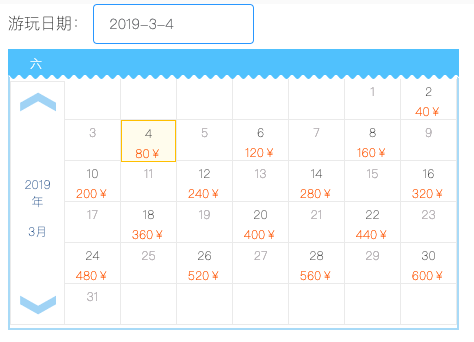

<h1>价格日历</h1>

<h3>1 、日历主要逻辑</h3>
<ul>
<li>日历主要展示了每个月有多少天, 以及对应是星期几, 因此需要一个时间函数, 通过这个函数, 我可以输入年和月, 返回本月有多少天.</li>
<li>日历需要循环展示日期, 因此我需要一个数组. 为了日后的扩展需要, 数组之中应该是一个对象.</li>
<li>本次日历还需要展示上月和下月的几天, 我又需要知道本月的1号和最后一号是周几, 上月需要显示几天, 下月需要显示几天.</li>
<li>整百年与非整百年的润年判定.</li>
<li>点击事件与UI的整体展.</li>
</ul>

<h3>2、效果图展示</h3>


<h3>3、代码展示</h3>
<h5>html代码</h5>

``` html{0}
<template>
  <div class="calendar">
    <div @click="calendarShow=true"> 游玩日期： <el-input :value="timeVal" icon="ios-calendar-outline" placeholder="Enter text" style="width: auto" :readonly="true" /></div>
    <!-- 日历展示区 -->
    <div class="content" v-if="calendarShow">
      <!-- 日历头部 -->
      <ul class="tit">
        <li v-for="(item) in weekList" :key="item">{{item}}</li>
        <li class="clear"></li>
      </ul>
      <!-- 日历内容 -->
      <div class="layoutfix">
        <!-- 日历左区域 -->
        <div class="left">
          <div class=" btn up uphover upact" @click="pickMonth('pre')"></div>
          <div class="centent">
            <p>{{year}}年</p>
            <p>{{month}}月</p>
          </div>
          <div class="btn down downhover downact" @click="pickMonth('next')"></div>
        </div>
        <!-- 日历右区域 -->
        <ul class="rcontent">
          <li v-for="(item,idx) in dayList" :key="idx" >
            <div v-if="item.price" :class="timeVal===item.time?'actsel act':'actsel'"  @click="selectDay(item.time)">
              <p class="dayPrice">{{item.days}}</p>
              <p class="price">{{item.price}}￥</p>
            </div>
            <div v-else>
              <p v-if="item.isMain">{{item.days}}</p>
            </div>
          </li>
          <div class="clear"></div>
        </ul>
      </div>
    </div>
  </div>
</template>

```
<h5>JS代码</h5>

```js{0}
<script>
export default {
  data () {
    return {
      calendarShow: true,
      timeVal: '请选择使用日期', // 时间
      weekList: ['六', '五', '四', '三', '二', '一', '日' ],
      dayList: [],
      month: '',
      year: ''
    }
  },
  computed: {},
  mounted () {
    this.getdaymunArr()
  },
  methods: {
    /** 获取当前时间 当有传入时间采用传入时间，若是没有的话就采用系统默认时间**/
    getTime (time) {
      let date = time ? new Date(time) : new Date()
      let year = date.getFullYear()
      let month = date.getMonth() + 1
      let day = date.getDate()
      let week = date.getDay()
      return { year, month, day, week }
    },
    /** 计算每个月天数**/
    getdayMun (year, month) {
      let monthArr = [1, 3, 5, 7, 8, 10, 12]
      let num = year % 100 === 0 ? 400 : 4
      let isLeap = year % num === 0 // 计算闰年
      if (monthArr.indexOf(month) !== -1) {
        return 31
      } else if (month === 2 & isLeap) {
        return 29
      } else if (month === 2) {
        return 28
      } else return 30
    },
    // 上个月末尾时间
    getPreArr (year, month, monthNum, length) {
      let arr = []
      for (let i = 0; i < length; i++) {
        let week = i
        let days = monthNum - length + i + 1
        let time = `${year}-${month}-${days}`
        let isMain = false
        arr.push({ week, days, time, isMain })
      }
      return arr
    },
    // 下个月开始时间
    getNextArr (nextYear, nextMonth, length) {
      let arr = []
      for (let i = 0; i < length; i++) {
        let week = 6 - length + i + 1
        let days = i + 1
        let time = `${nextYear}-${nextMonth}-${days}`
        let isMain = false
        arr.push({ week, days, time, isMain })
      }
      return arr
    },
    /** 计算当前月份有多少天**/
    getdaymunArr (timeStr) {
      let { year, month } = this.getTime(timeStr)
      let monthNum = this.getdayMun(year, month)
      let preMonth = month - 1 === 0 ? 12 : month - 1
      let nextMonth = month + 1 === 13 ? 1 : month + 1
      let preYear = preMonth === 12 ? year - 1 : year
      let nextYear = nextMonth === 1 ? year + 1 : year
      let preMonthNum = this.getdayMun(preYear, preMonth) // 前月天数
      let firWeek = this.getTime(`${year}-${month}-1`).week // 本月初是周几
      let lastWeek = this.getTime(`${year}-${month}-${monthNum}`).week
      let length = 6 - lastWeek
      let preArr = this.getPreArr(preYear, preMonth, preMonthNum, firWeek)
      let nextArr = this.getNextArr(nextYear, nextMonth, length)
      let arrs = []
      for (let i = 0; i < monthNum; i++) {
        let week = i % 7
        let days = i + 1
        let time = `${year}-${month}-${days}`
        let isMain = true
        let price = days % 2 === 0 ? `${days + days}0` : ''
        arrs.push({ week, days, time, isMain, price })
      }
      let array = [...preArr, ...arrs, ...nextArr]
      this.year = year
      this.month = month
      this.dayList = array
    },

    /** 年切换**/
    pickYear (year) {
      this.year = year
      let str = `${year}-${this.month}-1`
      let dayArr = this.getdaymunArr(str)
    },

    /** 月切换**/
    pickMonth (param) {
      if (param === 'pre') {
        if (this.month - 1 === 0) {
          this.month = 12
          this.year--
          this.pickYear(this.year)
        } else {
          this.month = this.month - 1
        }
      } else {
        if (this.month + 1 === 13) {
          this.month = 1
          this.year++
          this.pickYear(this.year)
        } else {
          this.month = this.month + 1
        }
      }
      let str = `${this.year}-${this.month}-1`
      let dayArr = this.getdaymunArr(str)
    },
    /** 当前点击日期**/

    selectDay (time) {
      this.timeVal = time
      this.calendarShow = false
      console.log(time)
    }
  }
}
</script>

```

<h5>css代码</h5>

```css{0}
<style lang="less" scoped>
@calendarW: 451px;
@calendarH: 281px;
@titH: 30px;
@titW: 56px;
@dayH: 41px;
@leftW: 55px;
@leftH: 244px;
.calendar {
  margin-left: 10px;
.content {
    width: @calendarW;
    height: @calendarH;
    margin-top: 5px;
    font-size: 12px;
    background-color: #fff;
    border: 2px solid #b1daf5;
  .clear {
    clear: both;
    content: "";
    display: block;
    height: 0;
    overflow: hidden;
  }
  ul {
      width: @calendarW;
      height: @calendarH;
    li {
        width: @titW;
        height: @titH;
        line-height: @titH;
        // float: right;
        text-align: center;
      p {
        margin-top: 5px;
        width: 100%;
        line-height: 15px;
      }
      .price {
        color: #f60;
      }
      .dayPrice {
        color: #333;
      }
    }
  }
  .tit {
    width: @calendarW;
    margin: -2px 0 0 -2px;
    background-position: 0 -197px;
    background-image: url("./img/ticket_order.png");
    background-repeat: repeat-x;
    color: #fff;
    height: @titH;
  }
.layoutfix {
.left {
    padding: 10px 0px;
    box-sizing: border-box;
    position: relative;
    // float: left;
    width: @leftW;
    height: @leftH;
    text-align: center;
    color: #1a477e;
    font-weight: 700;
    border: 1px solid #eaeaea;
    margin-top: 2px;
    .btn {
        cursor: pointer;
        margin: 0 auto;
        height: 20px;
        width: 36px;
        background: url("./img/ticket_order.png") no-repeat;
      }
    .centent {
      margin-top: 10px;
      margin-bottom: 10px;
      margin: 0 auto;
      height: 183px;
      width: 36px;
      p {
        position: relative;
        top: 50%;
        transform: translateY(-80%);
      }
    }
  .up {background-position: -80px -230px;}
  .uphover {
    &:hover {
      background-position: -40px -230px;
    }
  }
  .upact {background-position: 0 -230px;}
  .down {background-position: -80px -250px;}
  .downhover {
    &:hover {background-position: -40px -250px;}
  }
  .downact {background-position: 0 -250px;}
  }
  .rcontent {
    .actsel {
      &:hover {
        cursor: pointer;
        background-color: #fffbee;
        border: 1px solid #febe32;
      }
    }
    .actsel.act {
      cursor: pointer;
      background-color: #fffbee;
      border: 1px solid #febe32;
    }
    li {
      color: #adaaad;
      float: left;
      height: @dayH;
      border-bottom: 1px solid #eaeaea;
      border-right: 1px solid #eaeaea;
    }
  }
}
}
}
</style>

```
