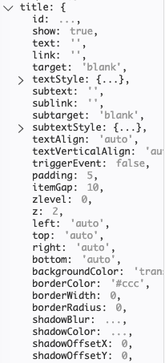
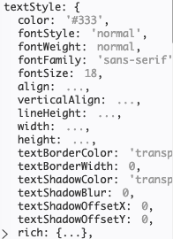
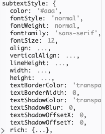
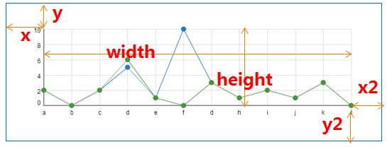
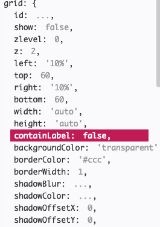
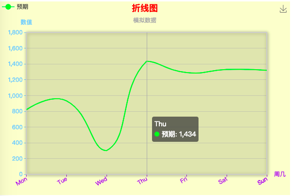
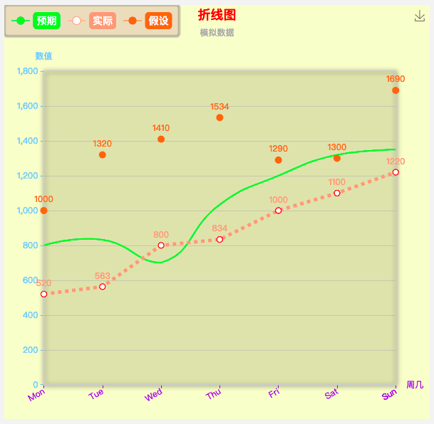
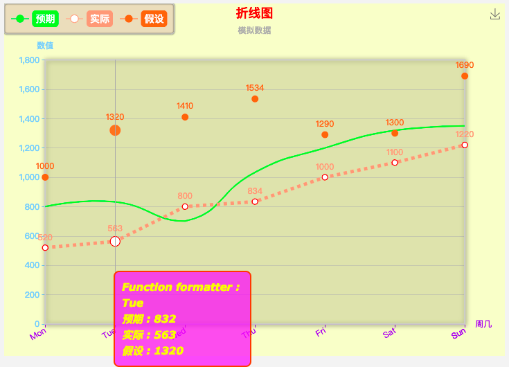

1、title属性
---

<h3>1、标题图片展示说明</h3>


<h4>1.1、title属性、title的textStyle属性与subtextStyle属性说明：</h4>





<h3>2、grid网络绘图</h3>


<h4>2.1、grid的属性</h4>


<h3>3 效果图</h3>


<h3>4、代码展示</h3>
<h5>html代码</h5>

``` html{0}
<!DOCTYPE html>
<html>

<head>
  <meta charset="utf-8">
  <title>ECharts</title>
  <!-- 引入 echarts.js -->
  <script src="./echarts.js"></script>
</head>

<body>
  <!-- 为ECharts准备一个具备大小（宽高）的Dom -->
  <div id="main" style="width: 600px;height:400px;"></div>
  
</body>

</html>
```
<h5>效果图JS代码</h5>

```js{0}
<script type="text/javascript">
    // 基于准备好的dom，初始化echarts实例
    var myChart = echarts.init(document.getElementById('main'));

    // 指定图表的配置项和数据
    var option = {

        backgroundColor: '#ffbb',
        textStyle: {
          // color:'green'
        },
        title: {
          text: '折线图',
          subtext: '模拟数据',
          x: 'center',
          textStyle: {
            color: 'red'
          }
        },
        //  图表距边框的距离,可选值：'百分比'| {number}（单位px）
        grid: {
          top: '16%',   // 等价于 y: '16%'
          left: '3%',
          right: '8%',
          bottom: '3%',
          containLabel: true,//区域是否包含坐标轴的刻度标签。
          show: true,//最多可以放置上下两个 X 轴，左右两个 Y 轴
          backgroundColor: '#ffb5',//控制网格的背景颜色，默认是透明色，此设置生效是设置show:true
          borderColor: '#ccc',//控制网格边框的颜色,此配置生效之前是设置show:true
          borderWidth: 2,//控制网格边框的粗细，此配置生效前提设置show:true
          shadowColor: 'rgba(0, 0, 0, 0.5)',//阴影的颜色
          shadowBlur: 10,//图形阴影的模糊大小  
          shadowOffsetX: 1,
          shadowOffsetY: 1,
          // zlevel:1,
          z: 2
        },

        legend: {
          // orient 设置布局方式，默认水平布局，可选值：'horizontal'（水平） | 'vertical'（垂直）
          orient: 'horizontal',
          // x 设置水平安放位置，默认全图居中，可选值：'center' | 'left' | 'right' | {number}（x坐标，单位px）
          x: 'left',
          // y 设置垂直安放位置，默认全图顶端，可选值：'top' | 'bottom' | 'center' | {number}（y坐标，单位px）
          y: 'top',
          data: ['预期']
        },

        // 提示框
        tooltip: {
          trigger: 'axis'
        },

        //工具框，可以选择
        toolbox: {
          feature: {
            saveAsImage: {} //下载工具
          }
        },

        xAxis: {
          name: '周几',
          type: 'category',
          axisLine: {
            lineStyle: {
              // 设置x轴颜色
              color: '#912CEE'
            }
          },
          // 设置X轴数据旋转倾斜
          axisLabel: {
            rotate: 30, // 旋转角度
            interval: 0  //设置X轴数据间隔几个显示一个，为0表示都显示
          },
          // boundaryGap值为false的时候，折线第一个点在y轴上
          boundaryGap: false,
          data: ['Mon', 'Tue', 'Wed', 'Thu', 'Fri', 'Sat', 'Sun']
        },

        yAxis: {
          name: '数值',
          type: 'value',
          min: 0, // 设置y轴刻度的最小值
          max: 1800,  // 设置y轴刻度的最大值
          splitNumber: 9,  // 设置y轴刻度间隔个数
          axisLine: {
            lineStyle: {
              // 设置y轴颜色
              color: '#87CEFA'
            }
          },
        },

        series: [
          {
            name: '预期',
            data: [820, 932, 301, 1434, 1290, 1330, 1320],
            type: 'line',
            // 设置小圆点消失
            // 注意：设置symbol: 'none'以后，拐点不存在了，设置拐点上显示数值无效
            symbol: 'none',
            // 设置折线弧度，取值：0-1之间
            smooth: 0.5,
          },
        ],

        color: ['#00EE00']
      };

    // 使用刚指定的配置项和数据显示图表。
    myChart.setOption(option);
  </script>

```

2、 legend
---
<h3>legend</h3>


```js
// 图例
    legend: {
        orient: 'horizontal',      // 布局方式，默认为水平布局，可选为：
                                   // 'horizontal' ¦ 'vertical'
        x: 'center',               // 水平安放位置，默认为全图居中，可选为：
                                   // 'center' ¦ 'left' ¦ 'right'
                                   // ¦ {number}（x坐标，单位px）
        y: 'top',                  // 垂直安放位置，默认为全图顶端，可选为：
                                   // 'top' ¦ 'bottom' ¦ 'center'
                                   // ¦ {number}（y坐标，单位px）
        backgroundColor: 'rgba(0,0,0,0)',
        borderColor: '#ccc',       // 图例边框颜色
        borderWidth: 0,            // 图例边框线宽，单位px，默认为0（无边框）
        padding: 5,                // 图例内边距，单位px，默认各方向内边距为5，
                                   // 接受数组分别设定上右下左边距，同css
        itemGap: 10,               // 各个item之间的间隔，单位px，默认为10，
                                   // 横向布局时为水平间隔，纵向布局时为纵向间隔
        itemWidth: 20,             // 图例图形宽度
        itemHeight: 14,            // 图例图形高度
        textStyle: {
            color: '#333'          // 图例文字颜色
        }
    },
    
```
<h5>效果图</h5>

<h5>效果图JS代码</h5>

```js{0}
option = {
 
        backgroundColor: '#ffbb',
        textStyle:{
            // color:'green'
        },
         title: {
          text: '折线图',
          subtext: '模拟数据',
          x: 'center',
          textStyle:{
              color:'red'
          }
        },
        //  图表距边框的距离,可选值：'百分比'| {number}（单位px）
        grid: {
            top: '16%',   // 等价于 y: '16%'
            left: '3%', 
            right: '8%',
            bottom: '3%',
            containLabel: true,
            show:true,//最多可以放置上下两个 X 轴，左右两个 Y 轴
            backgroundColor:'#ffb5',//控制网格的背景颜色，默认是透明色，此设置生效是设置show:true
            borderColor:'#ccc',//控制网格边框的颜色,此配置生效之前是设置show:true
            borderWidth:2,//控制网格边框的粗细，此配置生效前提设置show:true
            shadowColor: 'rgba(0, 0, 0, 0.5)',//阴影的颜色
            shadowBlur: 10  ,//图形阴影的模糊大小  
            shadowOffsetX:1,
            shadowOffsetY:1,
            // zlevel:1,
            z:2
        },
 
        legend: {
          // orient 设置布局方式，默认水平布局，可选值：'horizontal'（水平） | 'vertical'（垂直）
          orient: 'horizontal',
          // x 设置水平安放位置，默认全图居中，可选值：'center' | 'left' | 'right' | {number}（x坐标，单位px）
          x: 'left',
          // y 设置垂直安放位置，默认全图顶端，可选值：'top' | 'bottom' | 'center' | {number}（y坐标，单位px）
          y: 'top',
          borderColor:'#ccc',
          borderWidth:1,
          padding:10,
          backgroundColor:'#c1c1',
          borderRadius:4,
          shadowBlur:2,
        //   width:200,//图例组件的宽度
          height:50,
          textStyle:{
              fontSize:14,
            //   backgroundColor:'#ccc',//每个图例单独设置的是否，此设置无效
              padding:5,
              borderRadius:5,
              color:'#fff',//设置图例颜色
              
          },
          data: [
              {name:'预期',textStyle:{backgroundColor:'#00EE00'}},  
              {name:'实际',textStyle:{backgroundColor:'#ff9f7f'}}, 
              {name:'假设',textStyle:{backgroundColor:'#ff733a'}}
              ]
        },
 
        // 提示框
        tooltip: {
          trigger: 'axis'
        },
 
        //工具框，可以选择
        toolbox: {
            feature: {
                saveAsImage: {} //下载工具
            }
        },
 
        xAxis: {
          name: '周几',
          type: 'category',
          axisLine: {
            lineStyle: {
              // 设置x轴颜色
              color: '#912CEE'
            }
          },
          // 设置X轴数据旋转倾斜
          axisLabel: {
            rotate: 30, // 旋转角度
            interval: 0  //设置X轴数据间隔几个显示一个，为0表示都显示
            },
          // boundaryGap值为false的时候，折线第一个点在y轴上
          boundaryGap: false,
          data: ['Mon', 'Tue', 'Wed', 'Thu', 'Fri', 'Sat', 'Sun']
        },
 
        yAxis: {
          name: '数值',
          type: 'value',
          min:0, // 设置y轴刻度的最小值
          max:1800,  // 设置y轴刻度的最大值
          splitNumber:9,  // 设置y轴刻度间隔个数
          axisLine: {
            lineStyle: {
              // 设置y轴颜色
              color: '#87CEFA'
            }
          },
        },
 
        series: [
          {
            name: '预期',
            data: [800, 832, 701, 1034, 1200, 1320, 1350],
            type: 'line',
            // 设置小圆点消失
            // 注意：设置symbol: 'none'以后，拐点不存在了，设置拐点上显示数值无效
            symbol: 'none',
            // 设置折线弧度，取值：0-1之间
            smooth: 0.5,
          },       
         {
            name: '实际',
            data: [520, 563, 800, 834, 1000, 1100, 1220],
            type: 'line',
            // 设置折线上圆点大小
            symbolSize:8,
            itemStyle:{
              normal:{
                // 拐点上显示数值
                label : {
                show: true
                },
                borderColor:'red',  // 拐点边框颜色
                lineStyle:{                 
                  width:5,  // 设置线宽
                  type:'dotted'  //'dotted'虚线 'solid'实线
                }
              }
            }
          },
{
            name: '假设',
            data: [1000, 1320, 1410, 1534, 1290, 1300, 1690],
            type: 'line',
            // 设置折线上圆点大小
            symbolSize:10,
            // 设置拐点为实心圆
            symbol:'circle',            
            itemStyle: {
              normal: {
                // 拐点上显示数值
                label : {
                  show: true
                },
                lineStyle:{
                  // 使用rgba设置折线透明度为0，可以视觉上隐藏折线
                  color: 'rgba(0,0,0,0)'
                }
              }
            }
          }

        ],
        
        color: ['#00EE00','#ff9f7f','#ff733a']
      };

```

3、tooltip
---


```js
// 提示框
    tooltip: {
        trigger: 'item',           // 触发类型，默认数据触发，见下图，可选为：'item' ¦ 'axis'
        showDelay: 20,             // 显示延迟，添加显示延迟可以避免频繁切换，单位ms
        hideDelay: 100,            // 隐藏延迟，单位ms
        transitionDuration : 0.4,  // 动画变换时间，单位s
        backgroundColor: 'rgba(0,0,0,0.7)',     // 提示背景颜色，默认为透明度为0.7的黑色
        borderColor: '#333',       // 提示边框颜色
        borderRadius: 4,           // 提示边框圆角，单位px，默认为4
        borderWidth: 0,            // 提示边框线宽，单位px，默认为0（无边框）
        padding: 5,                // 提示内边距，单位px，默认各方向内边距为5，
                                   // 接受数组分别设定上右下左边距，同css
        axisPointer : {            // 坐标轴指示器，坐标轴触发有效
            type : 'line',         // 默认为直线，可选为：'line' | 'shadow'
            lineStyle : {          // 直线指示器样式设置
                color: '#48b',
                width: 2,
                type: 'solid'
            },
            shadowStyle : {                       // 阴影指示器样式设置
                width: 'auto',                   // 阴影大小
                color: 'rgba(150,150,150,0.3)'  // 阴影颜色
            }
        },
        textStyle: {
            color: '#fff'
        }
    },

```
<h5>效果图</h5>


<h5>效果图代码</h5>

```js
option = {
 
        backgroundColor: '#ffbb',
        textStyle:{
            // color:'green'
        },
         title: {
          text: '折线图',
          subtext: '模拟数据',
          x: 'center',
          textStyle:{
              color:'red'
          }
        },
        //  图表距边框的距离,可选值：'百分比'| {number}（单位px）
        grid: {
            top: '16%',   // 等价于 y: '16%'
            left: '3%', 
            right: '8%',
            bottom: '3%',
            containLabel: true,
            show:true,//最多可以放置上下两个 X 轴，左右两个 Y 轴
            backgroundColor:'#ffb5',//控制网格的背景颜色，默认是透明色，此设置生效是设置show:true
            borderColor:'#ccc',//控制网格边框的颜色,此配置生效之前是设置show:true
            borderWidth:2,//控制网格边框的粗细，此配置生效前提设置show:true
            shadowColor: 'rgba(0, 0, 0, 0.5)',//阴影的颜色
            shadowBlur: 10  ,//图形阴影的模糊大小  
            shadowOffsetX:1,
            shadowOffsetY:1,
            // zlevel:1,
            z:2
        },
 
        legend: {
          // orient 设置布局方式，默认水平布局，可选值：'horizontal'（水平） | 'vertical'（垂直）
          orient: 'horizontal',
          // x 设置水平安放位置，默认全图居中，可选值：'center' | 'left' | 'right' | {number}（x坐标，单位px）
          x: 'left',
          // y 设置垂直安放位置，默认全图顶端，可选值：'top' | 'bottom' | 'center' | {number}（y坐标，单位px）
          y: 'top',
          borderColor:'#ccc',
          borderWidth:1,
          padding:10,
          backgroundColor:'#c1c1',
          borderRadius:4,
          shadowBlur:2,
        //   width:200,//图例组件的宽度
          height:50,
          textStyle:{
              fontSize:14,
            //   backgroundColor:'#ccc',//每个图例单独设置的是否，此设置无效
              padding:5,
              borderRadius:5,
              color:'#fff',//设置图例颜色
              
          },
          data: [
              {name:'预期',textStyle:{backgroundColor:'#00EE00'}},  
              {name:'实际',textStyle:{backgroundColor:'#ff9f7f'}}, 
              {name:'假设',textStyle:{backgroundColor:'#ff733a'}}
              ]
        },
 
        // 提示框
        tooltip: {
           trigger: 'axis',
        //show: true,   //default true
        showDelay: 0,
        hideDelay: 50,
        transitionDuration:0,
        backgroundColor : 'rgba(255,0,255,0.7)',
        borderColor : '#f50',
        borderRadius : 8,
        borderWidth: 2,
        padding: 10,    // [5, 10, 15, 20]
        position : function(p) {
            // 位置回调
            // console.log && console.log(p);
            return [p[0] + 10, p[1] - 10];
        },
        textStyle : {
            color: 'yellow',
            decoration: 'none',
            fontFamily: 'Verdana, sans-serif',
            fontSize: 15,
            fontStyle: 'italic',
            fontWeight: 'bold'
        },
        formatter: function (params,ticket,callback) {
            console.log(params)
            var res = 'Function formatter : <br/>' + params[0].name;
            for (var i = 0, l = params.length; i < l; i++) {
                res += '<br/>' + params[i].seriesName + ' : ' + params[i].value;
            }
            setTimeout(function (){
                // 仅为了模拟异步回调
                callback(ticket, res);
            }, 1000)
            return 'loading...';
        }
        },
 
        //工具框，可以选择
        toolbox: {
            feature: {
                saveAsImage: {} //下载工具
            }
        },
 
        xAxis: {
          name: '周几',
          type: 'category',
          axisLine: {
            lineStyle: {
              // 设置x轴颜色
              color: '#912CEE'
            }
          },
          // 设置X轴数据旋转倾斜
          axisLabel: {
            rotate: 30, // 旋转角度
            interval: 0  //设置X轴数据间隔几个显示一个，为0表示都显示
            },
          // boundaryGap值为false的时候，折线第一个点在y轴上
          boundaryGap: false,
          data: ['Mon', 'Tue', 'Wed', 'Thu', 'Fri', 'Sat', 'Sun']
        },
 
        yAxis: {
          name: '数值',
          type: 'value',
          min:0, // 设置y轴刻度的最小值
          max:1800,  // 设置y轴刻度的最大值
          splitNumber:9,  // 设置y轴刻度间隔个数
          axisLine: {
            lineStyle: {
              // 设置y轴颜色
              color: '#87CEFA'
            }
          },
        },
 
        series: [
          {
            name: '预期',
            data: [800, 832, 701, 1034, 1200, 1320, 1350],
            type: 'line',
            // 设置小圆点消失
            // 注意：设置symbol: 'none'以后，拐点不存在了，设置拐点上显示数值无效
            symbol: 'none',
            // 设置折线弧度，取值：0-1之间
            smooth: 0.5,
          },       
         {
            name: '实际',
            data: [520, 563, 800, 834, 1000, 1100, 1220],
            type: 'line',
            // 设置折线上圆点大小
            symbolSize:8,
            itemStyle:{
              normal:{
                // 拐点上显示数值
                label : {
                show: true
                },
                borderColor:'red',  // 拐点边框颜色
                lineStyle:{                 
                  width:5,  // 设置线宽
                  type:'dotted'  //'dotted'虚线 'solid'实线
                }
              }
            }
          },
{
            name: '假设',
            data: [1000, 1320, 1410, 1534, 1290, 1300, 1690],
            type: 'line',
            // 设置折线上圆点大小
            symbolSize:10,
            // 设置拐点为实心圆
            symbol:'circle',            
            itemStyle: {
              normal: {
                // 拐点上显示数值
                label : {
                  show: true
                },
                lineStyle:{
                  // 使用rgba设置折线透明度为0，可以视觉上隐藏折线
                  color: 'rgba(0,0,0,0)'
                }
              }
            }
          }

        ],
        
        color: ['#00EE00','#ff9f7f','#ff733a']
      };

```
<p><a src="https://www.echartsjs.com/option.html#visualMap">
参考网站--eachart:https://www.echartsjs.com/index.html</a></p>
<p><a src="https://echarts.baidu.com/echarts2/doc/example/themeDesigner.html#">
参考网站--echart:https://echarts.baidu.com/echarts2/doc/example.html</a></p>