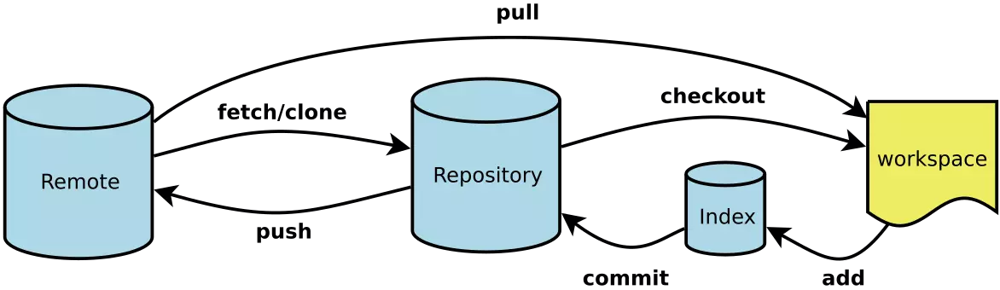

<h4>1.1 Git工作原理</h4>



- Workspace:工作区
  - 执行git add *命令就把改动提交到了暂存区
  - 执行git pull命令将远程仓库的数据拉到当前分支并合并
  - 执行git checkout [branch-name]切换分支
- Index:暂存区
  - 执行git commit -m '说明' 命令就把改动提交到了仓库区（当前分支）
- Repository:仓库区（或本地仓库）
  - 执行git push origin master提交到远程仓库
  - 执行git clone 地址将克隆远程仓库到本地
- Remote:远程仓库，就是类似github，coding等网站所提供的仓库

<h4>1.2 忽略特定的文件</h4>
<p>可以配置Git忽略特定的文件或者是文件夹。这些配置都放在.gitignore文件中。这个文件可以存在于不同的文件夹中，可以包含不同的文件匹配模式。
比如.gitignore内容可以如下：</p>

```js
忽略某文件
npm-debug.log
忽略文件夹
dist/
node_modules/
.idea/
```

<h4>1.3 使用.gitkeep来追踪空的文件夹</h4>
<p>Git会忽略空的文件夹。如果你想版本控制包括空文件夹，根据惯例会在空文件夹下放置.gitkeep文件。其实对文件名没有特定的要求。一旦一个空文件夹下有文件后，这个文件夹就会在版本控制范围内。</p>
<h4>1.4 配置</h4>

```js
# 显示当前的Git配置
$ git config --list
# 编辑Git配置文件，只是配置用户信息的话直接看下面两行命令即可
$ git config -e [--global]
# 设置提交代码时的用户信息，是否加上全局--global自行决定，一般是直接设置全局的。另外用户邮箱需要注意最好使用gmail,QQ也可以，需要和你远程仓库保持一致不然你的contribution是不会被记录在远程仓库的
$ git config [--global] user.name "[name]"
$ git config [--global] user.email "[email address]"
```
<h4>1.5 Git安装</h4>

[安装地址](https://git-scm.com/)

<h4>1.6 创建仓库</h4>

```js
# 在当前目录创建一个文件夹
$ mkdir [project-name]
# 在当前目录新建一个Git代码库 
$ git init
# 新建一个目录，将其初始化为Git代码库
$ git init [project-name]
# 下载一个项目和它的整个代码历史（各个分支提交记录等）
$ git clone [url]
```
<p>提示：git init后会出现.git文件夹，里面有配置文件，如果没有git bash里面输入ls -lah就可以看到了</p>

<h4>1.7 提交文件--首次推送</h4>

```js
# 添加当前目录的所有文件到暂存区
$ git add *
# 提交暂存区到仓库区
$ git commit -m [message]
# 为远程Git更名为origin
$ git remote add origin git@github.com:abcd/tmp.git
# 推送此次修改，这是首次推送需要加上-u,之后推送就可以直接git push  origin master,origin是远程Git名字，这个可以自己定义，不过一般是用origin罢了，master是默认的分支，如果不在master分支提交需要写清楚分支名称
$ git push -u origin master
```

<p>首次推送成功后可以看下下面的命令：</p>

```js
# 添加指定文件到暂存区
$ git add [file1] [file2] ...
# 添加指定目录到暂存区，包括子目录
$ git add [dir]
# 添加当前目录的所有文件到暂存区
$ git add *
# 添加每个变化前，都会要求确认对于同一个文件的多处变化，可以实现分次提交
$ git add -p
# 删除工作区文件，并且将这次删除放入暂存区
$ git rm [file1] [file2] ...
# 停止追踪指定文件，但该文件会保留在工作区
$ git rm --cached [file]
# 改名文件，并且将这个改名放入暂存区
$ git mv [file-original] [file-renamed]
# 提交暂存区到仓库区
$ git commit -m [message]
# 提交暂存区的指定文件到仓库区
$ git commit [file1] [file2] ... -m [message]
# 提交工作区自上次commit之后的变化，直接到仓库区
$ git commit -a
# 提交时显示所有diff信息
$ git commit -v
# 使用一次新的commit，替代上一次提交
如果代码没有任何新变化，则用来改写上一次commit的提交信息
$ git commit --amend -m [message]
# 重做上一次commit，并包括指定文件的新变化
$ git commit --amend [file1] [file2] ...
# 提交更改到远程仓库
$ git push origin master
# 拉取远程更改到本地仓库默认自动合并
$ git pull origin master

```
<h4>1.8 分支</h4>
<p>但如果是多人协作的话，git的魅力就开始提现出来了，每个人有自己的一个分支，各自在自己的分支上工作互不干扰。</p>

具体的看这：[点击查看](https://www.liaoxuefeng.com/wiki/896043488029600/900003767775424)

```js
# 列出所有本地分支
$ git branch
# 列出所有远程分支
$ git branch -r
# 列出所有本地分支和远程分支
$ git branch -a
# 新建一个分支，但依然停留在当前分支
$ git branch [branch-name]
# 新建一个分支，并切换到该分支
$ git checkout -b [branch]
# 新建一个分支，指向指定commit
$ git branch [branch] [commit]
# 新建一个分支，与指定的远程分支建立追踪关系
$ git branch --track [branch] [remote-branch]
# 切换到指定分支，并更新工作区
$ git checkout [branch-name]
# 切换到上一个分支
$ git checkout -
# 建立追踪关系，在现有分支与指定的远程分支之间
$ git branch --set-upstream [branch] [remote-branch]
# 合并指定分支到当前分支，如果有冲突需要手动合并冲突（就是手动编辑文件保存咯），然后add,commit再提交
$ git merge [branch]
# 选择一个commit，合并进当前分支
$ git cherry-pick [commit]
# 删除分支
$ git branch -d [branch-name]
# 删除远程分支
$ git push origin --delete [branch-name]
$ git branch -dr [remote/branch]

```

<h4>1.9 标签</h4>
<p>标签的作用主要是用来做版本回退的，关于版本回退，这也是Git的亮点之一，起到了后悔药的功能·</p>

```js
# 列出所有tag
$ git tag
# 新建一个tag在当前commit
$ git tag [tag]
# 新建一个tag在指定commit
$ git tag [tag] [commit]
# 删除本地tag
$ git tag -d [tag]
# 删除远程tag
$ git push origin :refs/tags/[tagName]
# 查看tag信息
$ git show [tag]
# 提交指定tag
$ git push [remote] [tag]
# 提交所有tag
$ git push [remote] --tags
# 新建一个分支，指向某个tag
$ git checkout -b [branch] [tag]

```

<h4>2.0 后悔药</h4>
<p>想一下在你写完N个文件代码后，commit到了本地仓库，突然发现整个应用崩溃了！咋整？Git给了我们吃后悔药的机会：</p>

```js
# 恢复暂存区的指定文件到工作区
$ git checkout [file]
# 恢复某个commit的指定文件到暂存区和工作区
$ git checkout [commit] [file]
# 恢复暂存区的所有文件到工作区
$ git checkout .
# 回退到上一个版本，在Git中，用HEAD表示当前版本
$ git reset --hard HEAD^
# 重置暂存区的指定文件，与上一次commit保持一致，但工作区不变
$ git reset [file]
# 重置暂存区与工作区，与上一次commit保持一致
$ git reset --hard
# 重置当前分支的指针为指定commit，同时重置暂存区，但工作区不变
$ git reset [commit]
# 重置当前分支的HEAD为指定commit，同时重置暂存区和工作区，与指定commit一致
$ git reset --hard [commit]
# 重置当前HEAD为指定commit，但保持暂存区和工作区不变
$ git reset --keep [commit]
# 新建一个commit，用来撤销指定commit
# 后者的所有变化都将被前者抵消，并且应用到当前分支
$ git revert [commit]
# 暂时将未提交的变化移除，稍后再移入
$ git stash
$ git stash pop
```
<p>这个时候标签的作用就体现出来了，因为commit号太冗长了，记起来太麻烦有了标签我们相当于自定义了commit号</p>

<h4>2.1 文件信息</h4>

```js
# 显示当前分支的版本历史
$ git log
# 显示commit历史，以及每次commit发生变更的文件
$ git log --stat
# 搜索提交历史，根据关键词
$ git log -S [keyword]
# 显示某个commit之后的所有变动，每个commit占据一行
$ git log [tag] HEAD --pretty=format:%s
# 显示某个commit之后的所有变动，其"提交说明"必须符合搜索条件
$ git log [tag] HEAD --grep feature
# 显示某个文件的版本历史，包括文件改名
$ git log --follow [file]
$ git whatchanged [file]
# 显示指定文件相关的每一次diff
$ git log -p [file]
# 显示过去5次提交
$ git log -5 --pretty --oneline
# 显示所有提交过的用户，按提交次数排序
$ git shortlog -sn
# 显示指定文件是什么人在什么时间修改过
$ git blame [file]
# 显示暂存区和工作区的差异
$ git diff
# 显示暂存区和上一个commit的差异
$ git diff --cached [file]
# 显示工作区与当前分支最新commit之间的差异
$ git diff HEAD
# 显示两次提交之间的差异
$ git diff [first-branch]...[second-branch]
# 显示今天你写了多少行代码
$ git diff --shortstat "@{0 day ago}"
# 显示某次提交的元数据和内容变化
$ git show [commit]
# 显示某次提交发生变化的文件
$ git show --name-only [commit]
# 显示某次提交时，某个文件的内容
$ git show [commit]:[filename]

```
<h4>2.2 其他命令</h4>

```js
# git blame清楚的记录某个文件的更改历史和更改人，简直是查看背锅人的利器，filepath是需要查看的文件路径
$ git blame filepath
# 显示有变更的文件
$ git status
# 显示当前分支的最近几次提交
$ git reflog
```

- [文档来源](https://juejin.im/post/582bd0b4da2f600063d4f89e)
- [拓展学习](https://juejin.im/post/5a2cdfe26fb9a0452936b07f)