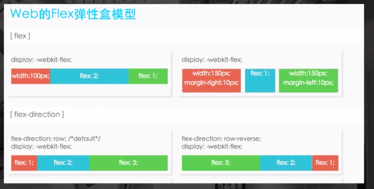

<h1>移动web相关基础知识</h1>
<h3>问题1:为什么iphone5分辨率640*1136在模拟机上是320*568</h3>
<h4>移动开发像素知识</h4>
<ul>
<li>PX:css逻辑像素，浏览器使用的抽象单位</li>
<li>dp,pt:设备无关像素</li>
<li>dpr:设备像素比例缩放</li>
<li>计算公式：1px=(dpr)^2*dp</li>
</ul>
<h3>回答问题1:因为iphone5的dpr=2</h3>
<h4>思路图展示：</h4>

<ul>
<li>DPI:打印机每英寸可以喷墨汁点（印刷行业）</li>
<li>PPI:屏幕每英寸的像素数量即单位英寸内的像素密度</li>
<p>目前，在计算机显示设备上参数描述都是一样</p>
<p>计算公式：以iPhone5为例：</p>
<p>ppi=√(1136ˆ2+640ˆ2)/4=326ppi(视网膜Retina屏)</p>
</ul>
<p>单位为硬件像素，非PX</p>
<p>ppi像素越高，图片就越清晰</p>
<h4>如下图解释：</h4>


<h3>问题2:一个PC的页面在移动设备上展示的效果是怎样的？</h3>
<h4>viewport手机浏览器默认为我们做了两件事：</h4>
<h5>1、页面渲染在一个980px（ios）的viewport上</h5>
<h5>2、缩放</h5>
<h3>为什么渲染时，要有viewport,为了排版</h3>
<p>viewport展示图</p>


<h4>meta标签</h4>


<p>所以有上图可以知道移动web最佳viewport设置：</p>
<p>【布局viewport】=【设备宽度】=【度量viewport】</p>
<p>最常用meta代码写法如下：</p>

``` html{0}
<head>
<meta name="viewport" content="width=device-width, initial-scale=1.0,user-scalable=no">
</head>
```
<h3>设计webapp</h3>


<h3>Flexbox弹性盒子布局</h3>

```css{0}
.nav{
  overflow:hidden;
  background:#de7c3c;
  padding:10px;
  display:webkit-flex;//使用弹性布局
}
.item{
  color:#fddfa7;
  padding:0 5px;
  text-align:center;
  flex:1;// 占容器的比例
}
```
<h4>按比例划分</h4>

<h4>混合使用</h4>

<h4>水平垂直中使用</h4>

